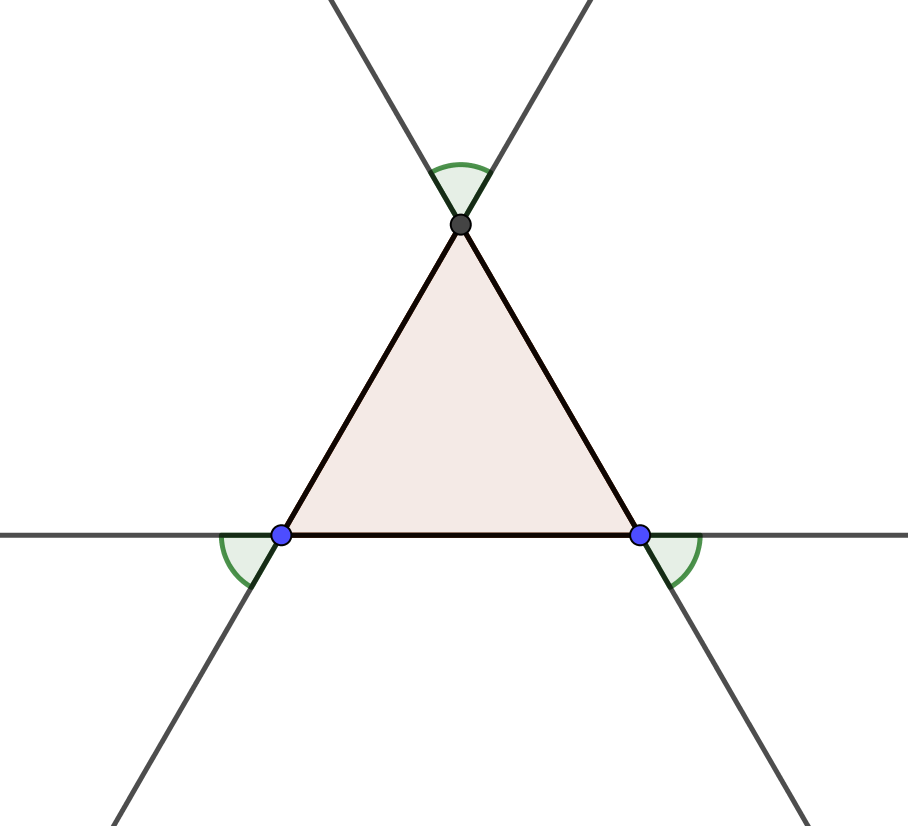
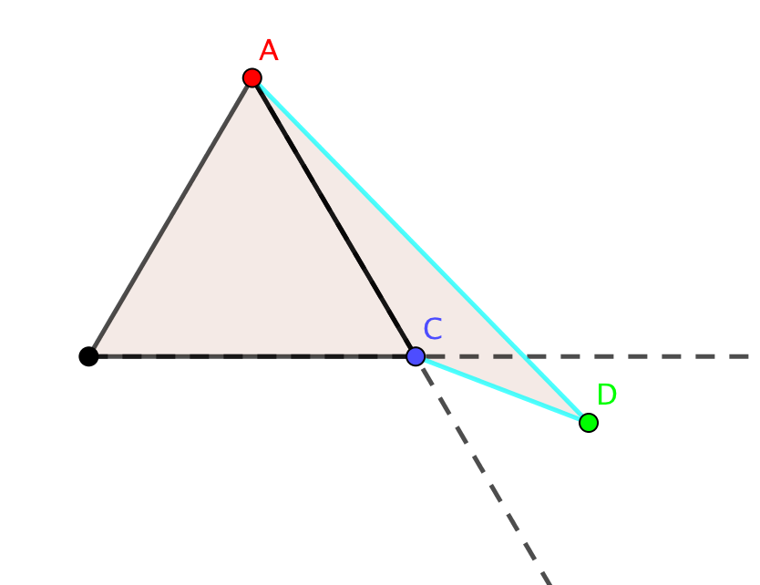
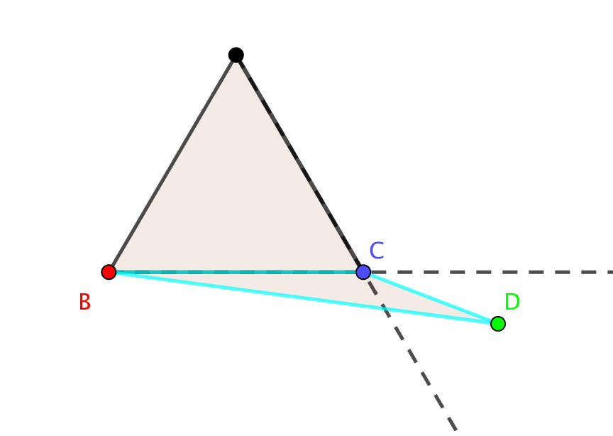
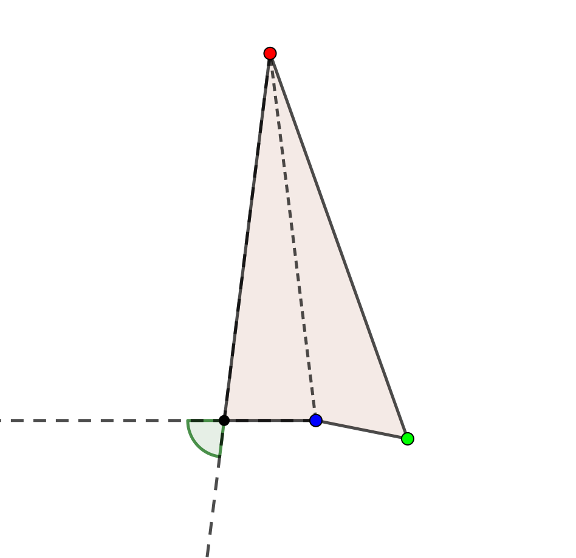
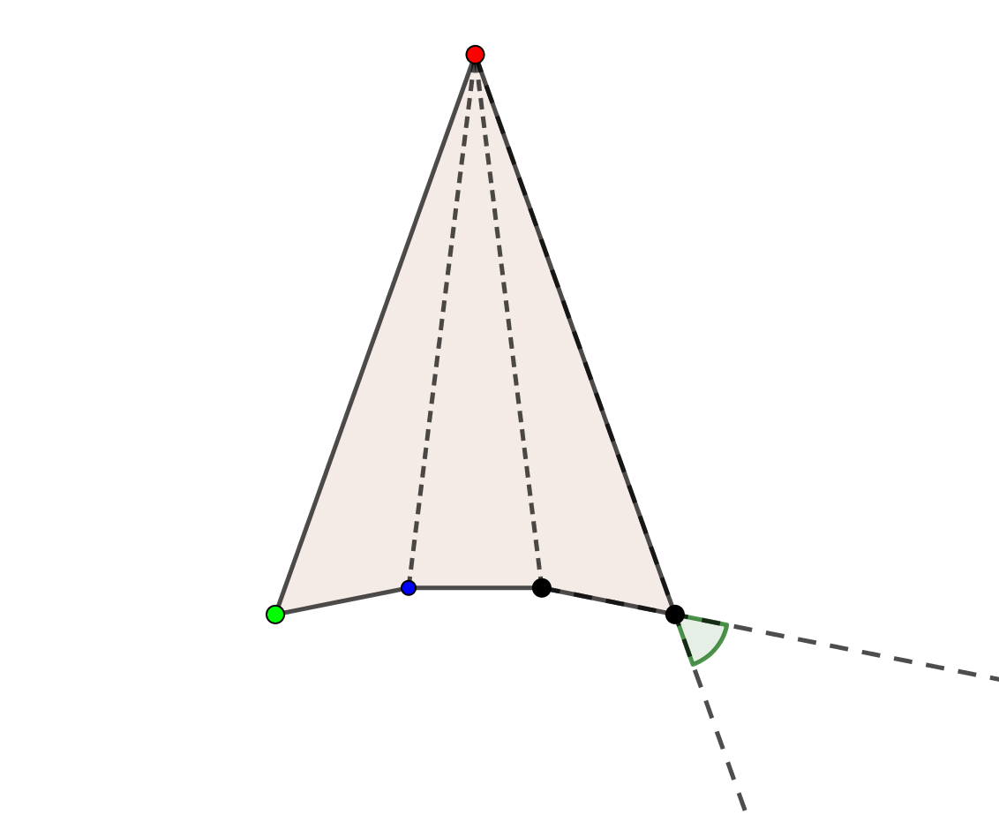
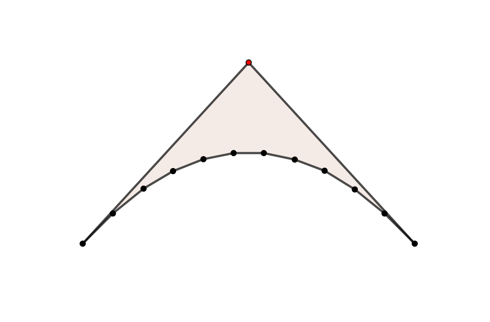

# 1.
## a.

```Python
def isClockwise(poly):
    sum = 0
    for i in range(0, poly.n):
        p = (poly.x[i], poly.y[i])
        next = (i + 1) % poly.n 
        q = (poly.x[next], poly.y[next])
        if cross(p, q) > 0: sum += 1
        elif cross(p, q) < 0: sum -=1
    return sum <= 0
```	
The algorithm takes the cross product of every edge and checks the polarity of the result. It sums all these polarities and if it is $< 0$ it is clockwise.

The algorithm only iterates through all points once, and calculating cross product is done in constant time. Therefore the runtime $= O(n)$.

## b.
```Python
def isSimple(poly):
    prev_x_prod = cross((poly.x[0], poly.y[0]), (poly.x[1], poly.y[1]))
    max_change = 1
    for i in range(1, poly.n):
        p = (poly.x[i], poly.y[i])
        next = (i + 1) % poly.n 
        q = (poly.x[next], poly.y[next])
        current_cross = cross(p,q)
        if (prev_x_prod * current_cross) < 0:
            max_change -= 1
        prev_x_prod = current_cross
    return max_change >= 0
```
Similar to algorithm 1.a., this algorithm checks the polarity of cross products. Instead of keeping track of all previous polarities, it only cares about the last polarity. Since simple convex polygons contain only one polarity change when iterating through the points successively, a convex polygon with more than one polarity change is complex.

The algorithm only iterates through all points once, and calculating cross product is done in constant time. Therefore the runtime $= O(n)$.

\newpage

# 2.
## a.

A triangle or polygon of size $n = 3$ has a unique triangulation. Adding a vertex to this polygon will create a quadrilateral. This vertex can be placed anywhere inside the triangle and produce a unique triangulation, but this is not the case for polygons of size $n > 3$ with unique triangulation. 

If we look outside the triangle we find areas that guarantee a quadrilateral with unique triangulation. A vertex placed inside these regions will not produce a diagonal in the new quadrilateral.

{ height=100 }

{ height=160 }
{ height=160 }

As you can see, point $C$ prevents a diagonal with the non-neighboring vertex.

Using these regions, you can construct polygons of size $n > 3$. For example:

{ height=160 }
{ height=160 }
{ height=160 }

For a polygon of this standard shape of size $n$, there exists valid regions outside its two ears. Since the lower $n-1$ vertices are strictly-convex, no diagonal exists between these points. Therefore each must have only a diagonal with the top vertex (the red vertex in the upper examples), and therefore there exists only one triangulation.

\newpage

# 3.
!!!
**Lucio**
!!!


# 4.
## a.
The cross product of two vectors $v_1$ and $v_2$ gives us the area of the parallelogram that they form. Half of this area gives us the area formed between the two vectors. 
The polarity of the cross product is determined by the orientation of the two vectors since 
$v_1 \times v_2 = -(v_2 \times v_1)$.

For each pair of points $p_i$ and $p_{i-1}$ that share an edge, the formula finds the cross product of the vectors from the origin to those points. e.g.
$$(x_i,y_i) \times (x_{i-1},y_{i-1}) = (x_i y_{i-1} - x_{i-1} y_i)$$
It then sums each of these cross-products and scales by $1/2$.
This leaves us with the area within the polygon. The orientation of the points correctly add and subtract the areas.

For a triangle ($p_1$, $p_2$, $p_3$), let $v_1$ be the vector from the origin to $p_1$, $v_2$ be the vector from the origin to $p_2$, and $v_3$ be the vector from the origin to $p_3$.

The area of the triangle is calculated as follows:
$$v_1 \times v_2 = x_1 y_2 - x_2 y_1$$
$$v_2 \times v_3 = x_2 y_3 - x_3 y_2$$
$$v_3 \times v_1 = x_3 y_1 - x_1 y_3$$

$$Area = \frac{1}{2} | (v_1 \times v_2) + (v_2 \times v_3) + (v_3 \times v_1) |$$
$$= \frac{1}{2} | x_1 y_2 - x_2 y_1 + x_2 y_3 - x_3 y_2 + x_3 y_1 - x_1 y_3 |$$

The other way to find the area of this triangle is by calculating the cross product between two of the edges of the triangle. Let's take, for example, the edges $(p_1,p_2)$ and $(p_1,p_3)$. This can be represented by our vectors from the origin as 
$(v_1 - v_2) = (x_1 - x_2, y_1 - y_2)$ and $(v_1 - v_3) = (x_1 - x_3, y_1 - y_3)$.

The area between these two edges is calculated as follows:
$$Area = \frac{1}{2} | (v_1 - v_2) \times (v_1 - v_3) |$$
$$= \frac{1}{2} | (x_1 - x_2)(y_1 - y_3) - (x_1 - x_3)(y_1 - y_2) |$$
$$= \frac{1}{2} | x_1 y_2 - x_2 y_1 + x_2 y_3 - x_3 y_2 + x_3 y_1 - x_1 y_3 |$$

As you can see, this is the same calculated area.

Since this finds the area of a triangle and any polygon can be triangulated, the area of a polygon is the sum of areas of the triangles. Since the given formula can be transformed into the sum of triangles, the formula correctly calculates the area of any polygon.


## b.


# 5.
## a.
The sum of interior angles is equal to $\pi (n-2)$. Reflex vertices are interior angles with an angle $>\pi$. Therefore there are at most $n-3$ reflex angles. In this worst case, there is an angle that can contain a diagonal with each reflex vertex, therefore there can be $n-3$ indispensable diagonals incident on that vertex.

## b.

## c.

## d.

