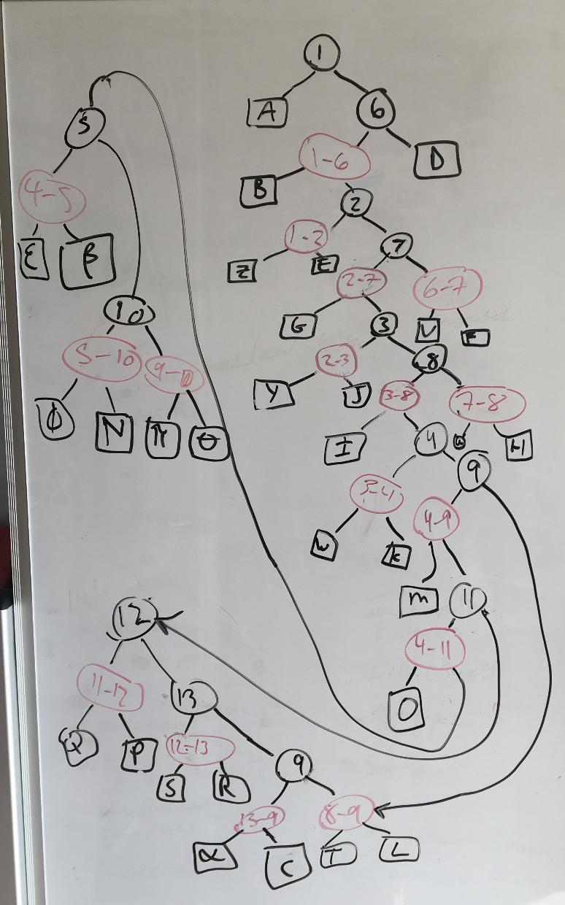
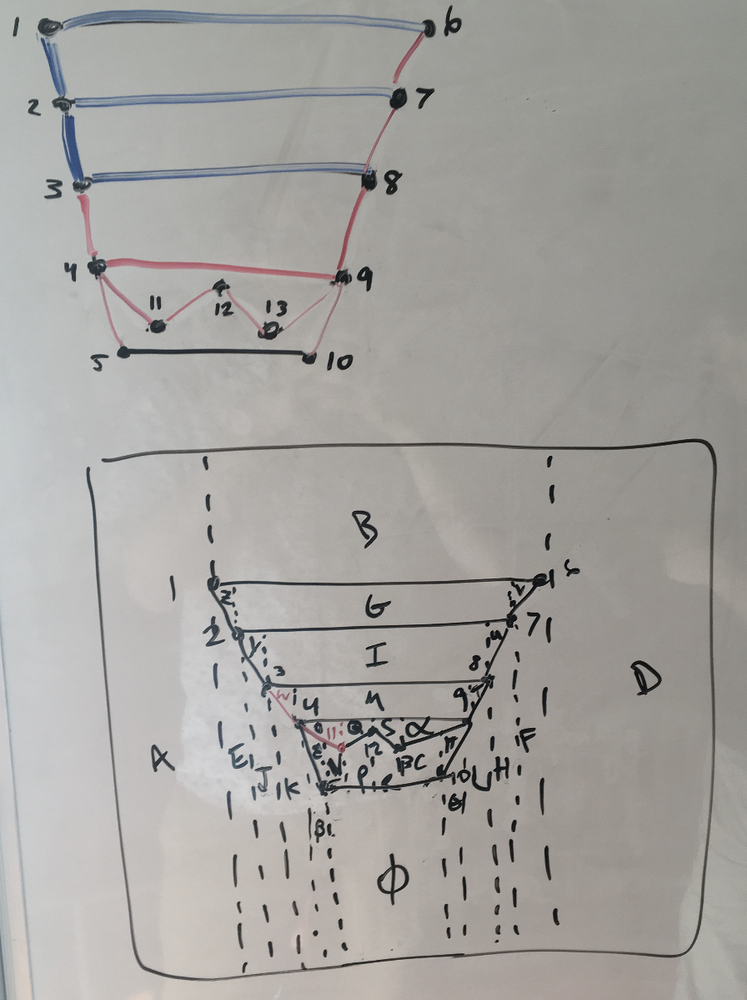
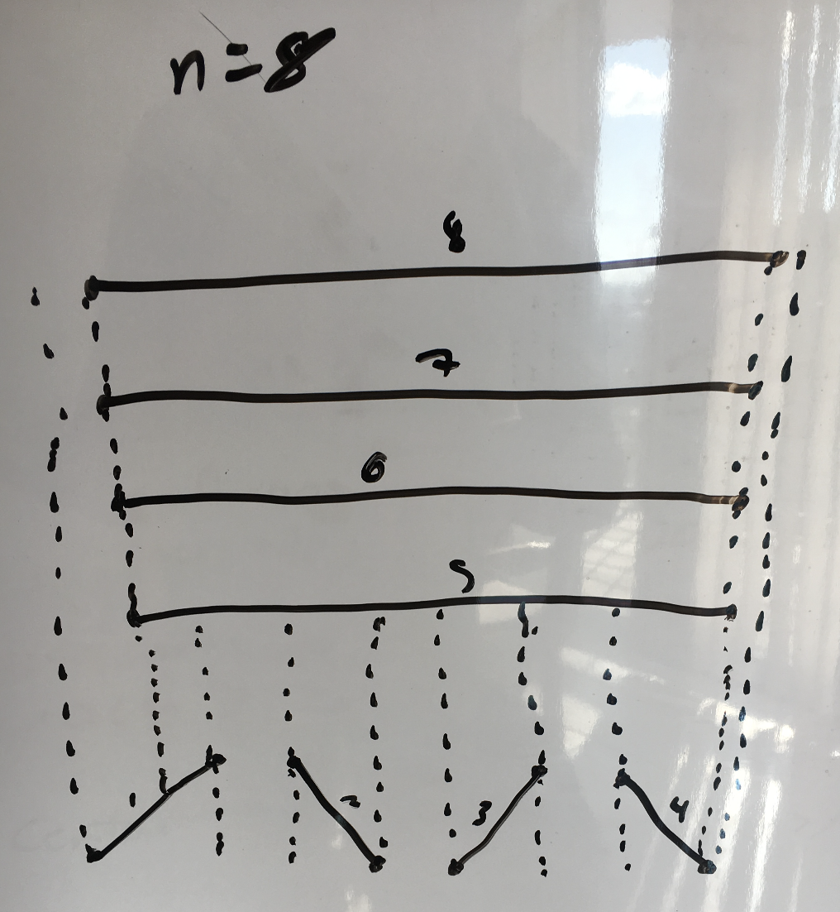

## 1)

To find the redundent half planes we can use the Halfplane Intersection algorthim from the Linear Programming section. This algorithim finds the intersectiong of a set of half planes to find the feasable region. To augment this algorithim to return the redundent halfplanes, we just need to modify IntersectConvexRegion procedure. Since this algorithim has to throw away half planes that do not intersect, we can use this to report those thrown away half planes and keep track of them. This will produce a set of half planes that are redundent and does not affect the runtime of the algorithim.

Since this algorithim runs in $O(nlogn)$ and our modification runs in $O(1)$, this new algorithim would run in $O(nlogn)$.

## 2)

Since all the rays $r_1,...,r_n$ are all vertical we can look at the anchors. To start, the algorithim would transform the anchors to the dual plane so the anchors become lines. Now the algorithim will build a trapizodial map on the dual plane of all the lines that were anchors in the primal. We can also represent this planar sub division, in a DCEL.  Building the trapizodial map can be done in $O(nlogn)$ and the space used is $O(n)$.

Now that there is a trapizodial map built for the anchors, we can do a point location with the query ray. Since it is a line in the primal, it becomes a point in the dual. Now that we have a point in the dual, we can point locate this point on dual with all the anchors. This location can be done in $O(logn)$ via the trapizodial map. Once we have located the point, we know what face the point is in and can thus find all the incident edges on that face.

Once we have found all the edges we can find all the verticies through the DCEL. To find the first ray that intersects the query ray, we need to find the line in the dual that is directly above the query point. We can then use exponental search on those verticies to find which segment the query point lies under. This can be done in the worst case $O(logn)$. The segment that lies above the query point represents the anchor to the ray that the query ray intersects. This data structure can be built in $O(nlogn)$ and uses $O(n)$ space. The query time is $O(logn)$.

\newpage

## 3)

### 6.1

------------------------------ --------------------------------------------------
{height=450px} {height=450px}
6.1.1 - The constructed graph  6.1.2 - The trapezoidal map used to build the tree
------------------------------ --------------------------------------------------

\newpage

### 6.2

{height=450px}

*Note: Bottom left -> bottom right -> horizontal from bottom to top, the numbers indicate order of insertion*

This example would have $\frac{n}{2}$ diagonal segments along the bottom, and $\frac{n}{2}$ horizontal segments above. The bottom segments would be inserted one at a time, left to right, resulting in a tree of size O($n$). You then insert each of the top horizontal segments one at a time, top-down. This will cause each O($n$) trapezoids below to point to O($n$) trapezoids above, therefore resulting in a total of O($n^2$) space required.

### 6.13

Direct Proof:

When sweeping over the trapezodial map, we stop at each endpoint. Each segment has two endpoints. The left endpoint produces two trapizoids to the right, one above and one below. The right endpoint produces one trapizoid to the right. From this we can then build the rest and see that there are $2n + n$ trapizoids generated from n segments. Since we skipped over the first trapizoid that was to the left of the left most endpoint of all the segments, we need to account for this by $2n + n + 1$. Therefore the max amount trapizoids is $3n + 1$.
