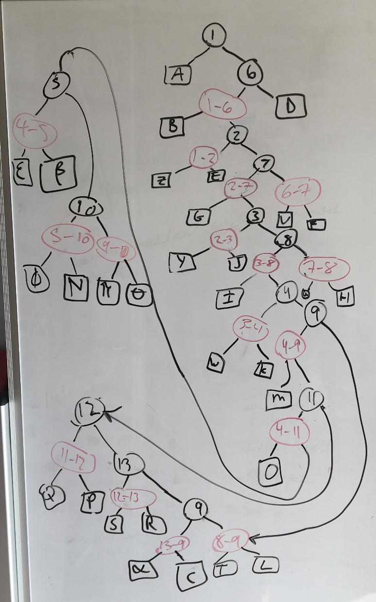
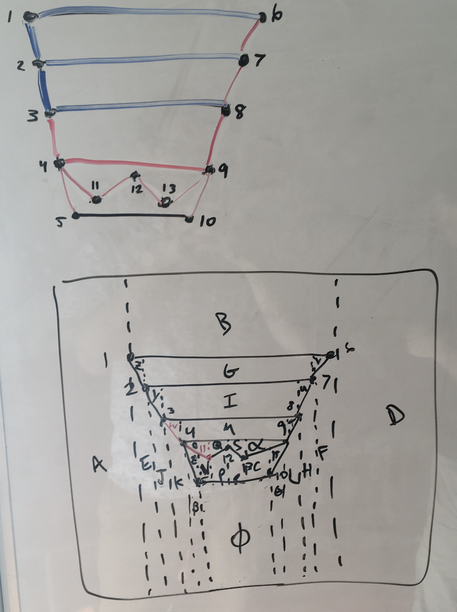
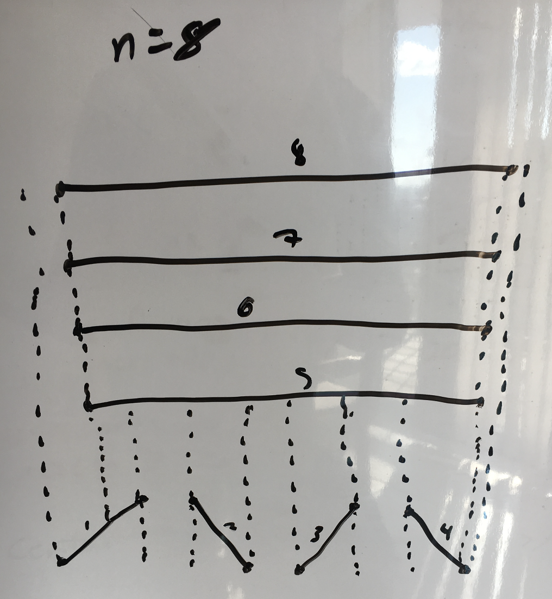

# 1.

The set of redundant half-planes are the compliment to $\cap H$, therefore they cannot be found faster than the time it takes to find $\cap H$. Therefore we should follow the given divide and conquer algorithm *(slide 19 of the linear programming slides)* to find half-planes that are not used during the merge phase.

On line 6 of the algorithm: `C = IntersectConvexRegions(C1,C2)`

This is the merge phase of the algorithm. Half-planes not used in this action are determined and not put into $C$. Therefore, if we report half-planes each time they get removed in O($1$), the runtime of our algorithm does not increase and stays O($n$log$n$).

# 2.

To find the first ray that $u$ intersects can be found in the dual plane. The transformation of all anchor points to the dual will be the a set of $n$ lines. The query ray $u$ will be a point in the dual, $u'$. All lines above $u'$ are anchor points below $u$ in the primal. And since all of the vertical rays point upward, the lines above $u'$ are the rays that $u$ intersects.

To find the first line above $u'$, we need to first transform all anchor points to lines in the dual. This set of dual lines can be represented as planar subdivision and therefore have a DCEL built on it. Building a DCEL on these dual lines can be done in O($n$log$n$) time with O($n$) space. Next, we then build a trapezoidal map $D$ on this DCEL, also in O($n$log$n$) time and O($n$) space.
This can now be used to point-locate our query rays.

Point location on $D$ can be done in O(log$n$) to find the containing face in the DCEL. We then find the edge of this face that is vertically above $u'$ in O(log$n$) time since the number of edges incident to a face is O($n$) in the worst case. Therefore our lookup time is O(log$n$).

\newpage

# 3.
## 6.1

------------------------------ --------------------------------------------------
{height=450px} {height=450px}
6.1.1 - The constructed graph  6.1.2 - The trapezoidal map used to build the tree
------------------------------ --------------------------------------------------

\newpage

## 6.2

{height=450px}

This example would have $\frac{n}{2}$ diagonal segments along the bottom, and $\frac{n}{2}$ horizontal segments above. The bottom segments would be inserted one at a time, left to right, resulting in a tree of size O($n$). You then insert each of the top horizontal segments one at a time, top-down. This will cause each O($n$) trapezoids below to point to O($n$) trapezoids above, therefore resulting in a total of O($n^2$) space required.

## 6.13
(Direct proof)

When sweeping over the trapezoidal map, count only trapezoids incident to the right of current point. Left endpoints have at most $2$ trapezoids (above and below the line to the right) and right endpoints have one trapezoid (line segment ends there).

There are $n$ line segments and therefore $n$ left endpoints and $n$ right endpoints.
Therefore we count $2n + n = 3n$ trapezoids. Accounting for the left-most trapezoid we skipped, we get $3n + 1$ total trapezoids.

Since we only count to the right of each endpoint, there is no overlap in our counting.

