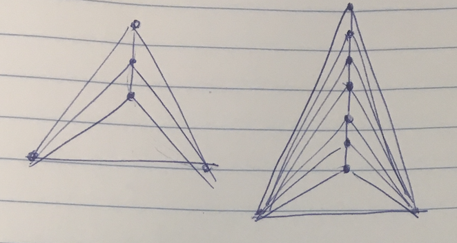

## 1)

### a)

For a flip graph to have a single node it must be formed from a point set that produces a unique triangulation. A general form for creating a unique triangulation from a set of points is to form a triangle from three points, this initally only has one node in its flip graph. To add more points, one would add points that are colinear as seen in Figure 1. These newly added points will form two more triangles that do not form a convex quadrilateral. Since it is not a convex quadrilateral there is only one way to form a triangulation and thus there is only one node in the flip graph.

{width=300px}

### b)

Similar to $a)$ we can construct a point set that produces two nodes in the flip graph. This can be done by expanding upon the triangle at the bottom. We can form a convex polygon with another point. This convex polygon will produce a flip since the polygon formed by those four points is convex.

## 2)

The problem can be reformulated as a complete graph between the center of each lily pad and two symbolic points that lie on the $y^+$ and the $y^-$. Each edge of the graph contains a weight that is the time $t$ at which the two lily pads meet. From the problem we know that the two lily pads grow at the same speed and thus meet half way down their connecting edge. Therefore the time at which they meet, if the lily pads grow at a rate of 1 unit per time, is $t_m = \frac{d_{ij}}{2}$.

From this complete graph the goal is to find the path from the two symbolic points created, so from $y^+$ to $y^-$, that *minimizes the largest segment*. The reason this path is our goal is because the first time, $t*$, that the turtle can cross is when there is a path of connected lily pads. Therefore since the weights of the complete graph are the times at which the two lily pads meet, the path that minimizes the largest segment will be the first path at which the turtle can cross.

To find this path, the complete graph needs to be decomposed into a subset of more relevant edges. The lily pads are only relevant when they first meet, so edges that connect lily pads that will meet after another lily pad and will thus never meet because it is behind the already connected lily pad. This subset can be represented as the delaunay triangulation because the closest neighbor of $b$ to any point $p$ has an edge on the delanunay triangulation. Thus each edge on the delaunay represents the closest lily pad and therefore the first one that it will meet in that directionand the path that minimizes the largest segment is a subset of edges on the delaunay.

The path can be found by forming the minimum spanning tree. This is because the minimum spanning tree creates the tree that has the least total sum of the weights of all edges. Therefore the path that minimizes the longest segment is a path on the minimum spanning tree of the delaunay. Therefore all that is needed is to run a path search from the two symbolic points and that path will be the first connected path that the turtle can cross on and the time $t^*$ is the weight of the largest segment along that path.

This algorithim takes $O(nlogn)$ since building the minimum spanning tree can be built in $O(nlogn)$.

## 5)

a)

