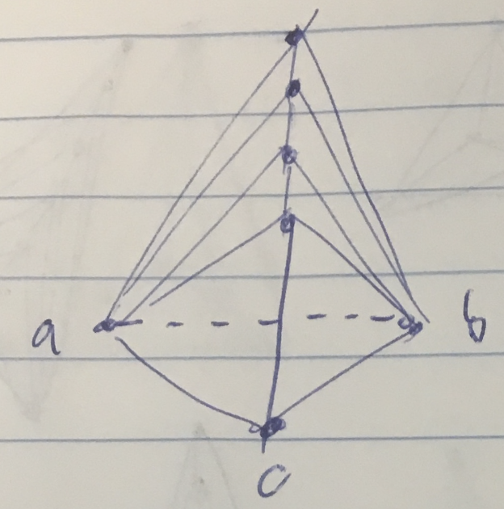
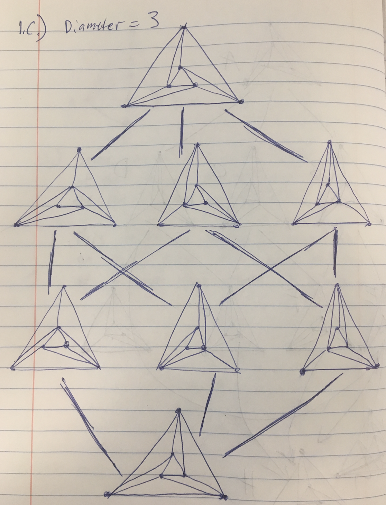
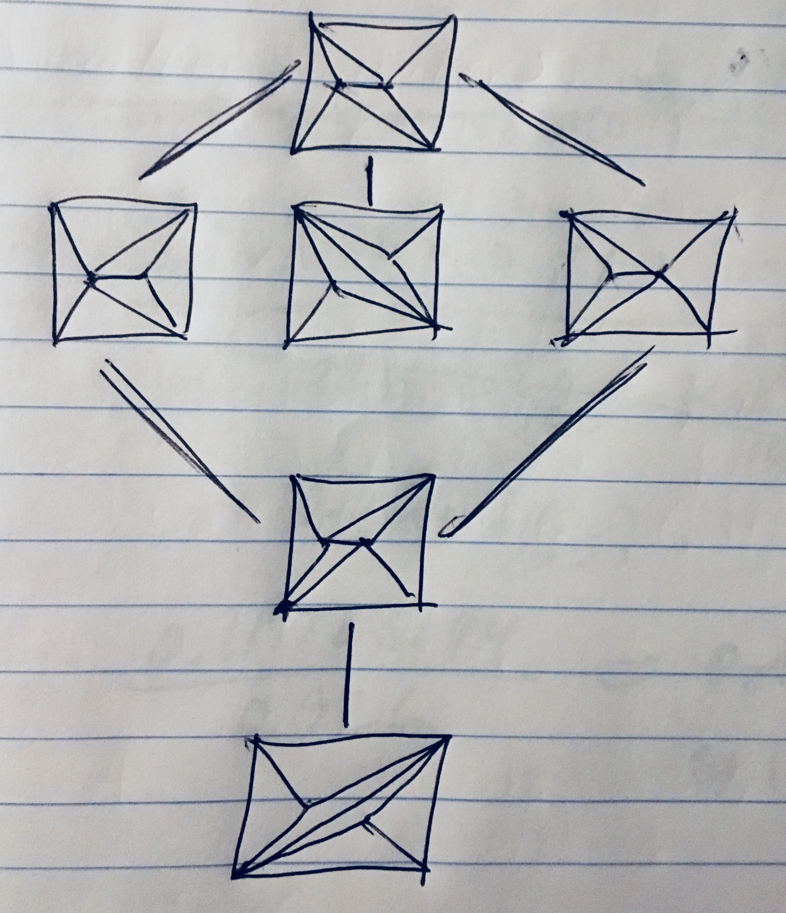
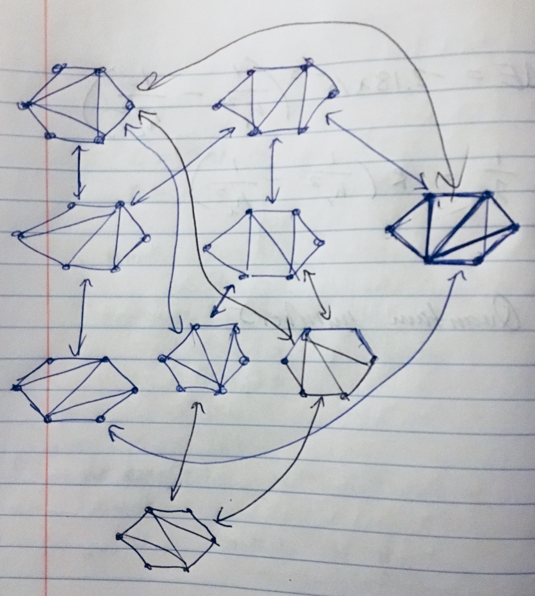

## 1)

### a)

For a flip graph to have a single node it must be formed from a point set that produces a unique triangulation. A general form for creating a unique triangulation from a set of points is to form a triangle from three points, this initally only has one node in its flip graph. To add more points, one would add points that are colinear as seen in Figure 1. These newly added points will form two more triangles that do not form a convex quadrilateral. Since it is not a convex quadrilateral there is only one way to form a triangulation and thus there is only one node in the flip graph.

{width=300px}

\newpage
### b)

Similar to $a)$ we can construct a point set that produces two nodes in the flip graph. This can be done by expanding upon the triangle at the bottom. We can form a convex polygon with another point. This convex polygon will produce a flip since the polygon formed by those four points is convex.

{width=200px}

### c)

{width=250px}

{width=250px}

{width=250px}

\newpage

## 2)

The problem can be reformulated as a complete graph between the center of each lily pad and two symbolic points that lie on the $y^+$ line and the $y^-$ line. Each edge of the graph contains a weight that is the time $t$ at which the two lily pads meet. From the problem we know that the two lily pads grow at the same speed and thus meet half way down their connecting edge. Therefore the time at which they meet, if the lily pads grow at a rate of 1 unit per time, is $t_m = \frac{d_{ij}}{2}$.

From this complete graph the goal is to find the path from the two symbolic points created, so from $y^+$ to $y^-$, that *minimizes the largest segment*. The reason this path is our goal is because the first time, $t*$, that the turtle can cross is when there is a path of connected lily pads. Therefore since the weights of the complete graph are the times at which the two lily pads meet, the path that minimizes the largest segment will be the first path at which the turtle can cross.

The path can be found by forming the minimum spanning tree. This is because the minimum spanning tree creates the tree that has the least total sum of the weights of all edges. Therefore the path that minimizes the longest segment is a path on the minimum spanning tree of the complete graph. Also since there are no cycles in the $MST$ there is only one path, and that path contains the smallest edges. Therefore all that is needed is to run a path search from the two symbolic points. The path that is produced will be the first connected path that the turtle can cross on and the time $t^*$ is the weight of the largest segment along that path.

This algorithim takes $O(nlogn)$ since building the minimum spanning tree can be built in $O(nlogn)$ and running a path search can be done in $O(V + E)$ and a spanning tree contains $n$ verticies and $n - 1$ edges, therefore the path can be found in $O(n)$.

## 3)

### a)

The realtionship between this projection and the voronoi cells of $P_1$ and $P_2$, is that the projection represents the $\frac{dist(p, q)^2}{2}$, and therefore represents the bisector line between the two points.

The equation for the projection of the intersection is $(a_1 - a_2)x + (b_1 - b_2)y = 0$.

### b)

Let $p$ and $q$ be an abitrary point in the point set, we know that the distance from the projection $q'$ on the parabaloid to the half-plane $h(p)$, as defined in the problem, is $dist(p, q)^2$. Since this also applies for the reverse when projecting $p'$, the intersection between the two half planes represents line that is the bisector between $p$ and $q$. If we take a third point $w$ and lift it up, the $h(w)$ would intersect with the two other half-planes, $h(p)$ and $h(q)$. The intersection of all three planes would produce a point that is eqidistant from all three points. Therefore that intersection produces a vertex in the voronoi diagram. Therefore the intersection and its projection between the positive half of the half-planes of the point set is the voronoi diagram.

## 4)

*Not completed*

## 5)

### a)

To find the closest point to query point $q$, one must search for the leaf where $q$ would go. Let $d$ be the Eclidean distance between $q$ and the point found during the search where we would split on. Now we have to check within the cirlce that is created from the point $q$ and the distance $d$ as the radius. Now recursively go back up the tree at each node, check if the distance $d$ to its defining line is smaller than $d$. If it is, recurse down its subtree and check its nodes, once arriving at a leaf node check its distance to $q$. If it is less than $d$ then update $d$ and the current closest point. If the defining line is not within $d$ then its sub-tree can be pruned.

The inital search takes $O(logn)$. Searching for points closer than $d$ is the 2D rectangular query search, with a decreasing rectangle, and there for $O(\sqrt{n})$.

### b)

To do this, one would store $k$ elements in each instance of a kd-tree. Each kd-tree would store elements sorted on the x cordinate. Therefore each tree would be bucketed and have consequtive elements in it. Thus it will take $O(\frac{logn}{k})$ to find which instace of the kd-tree an element would be in. To insert an element, first one must find which tree it will fit into and then reconstruct the tree, since the trees have a max size of $k$ the reconstruction would take $O(klogk)$, for small values of $k$ this is constant. If the tree has reached its limit, it is then split on the medain x value, and two new trees are created. To run the intersection query you first find which tree the element would be in, then search that tree. Since there are only $n$ points and each point is only stored once, the search time would continue to be $O(logn)$.

### c)

Similar to the method from $b)$. Since $k$ is a constant it would take constant time to rebuild the small trees and therefore insertions and deletions would run in O(k log k) which would be small for a small value of $k$.
