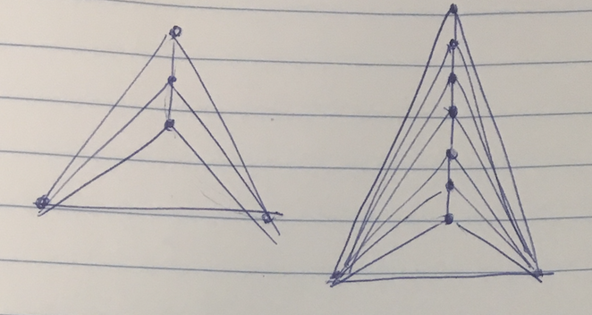
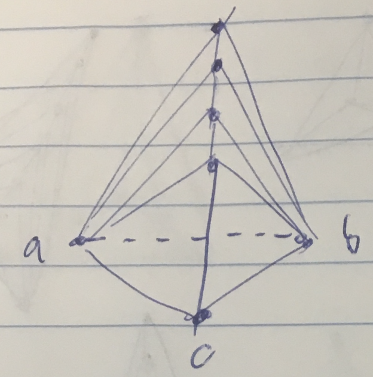

# 1.
## a.

A flip graph with a single node must be formed from a set of points with a unique triangulation.
Such a triangulation requires that no two neighboring triangles form a convex quadrilateral.

A set of points that have only one triangulation can formed from the following:

The general form of the set has $n-2$ collinear points (let the last points in either direction be $p_1$ or $p_{n-2}$). The set then has  two more points that form a triangle with $p_1$ or $p_{n-2}$, exterior to the $n-2$ points. 

More formally, start  with a triangle formed by $p_1$, $p_2$, and $p_3$. Then, add each remaining point exterior to the triangle. These points must fall on the line through $p_3$, perpendicular to the segment $p_1$, $p_2$.
At point $p_i$, the set of $i$ points will contain a unique triangulation. Adding $p_i$ will create two more triangles in its triangulation that together form a convex quadrilateral. 

Therefore, this construction will produce a point set with a single-node flip graph for all $n>3$.

{width=300px}

\newpage
## b.

The point set can be constructed the same as 1.a., but with one of the collinear points on the other side of points $1$ and $2$. This forms only one convex quadrilateral (only one flip) and a unique triangulation for $n-1$ points. Only having one flippable edge produces a flip-graph with two nodes.

{width=200px}

## c.

{width=200px}

\newpage
# 2.

The rate at which the lily pads grow can be defined as the function $v_i(t)$, and the radius of the lily pad can be defined as $x_i(t) = v_i t$. 

Take two lily pads, $L_1$ and $L_2$, with distance $d_{1 2}$ between them. 
The time at which they touch each other, $|x_1|+|x_2| = d_{1 2}$, and therefore 
$v_1 t + v_2 t = d_{1 2}$. Solving for $t$ results in $t = \frac{d_{12}}{v_1 + v_2}$.
According to the problem, all lily pads grow at the same constant rate. Therefore for two lily pads ($i$ and $j$), the time that they touch is $t = \frac{d_{id}}{2}$. 

The time that a lily pad touches a bank is equal to the distance from its center point to the bank. This can be shown by substituting into the previous equation, where the growth rate of the bank is $0$ and the growth of the lily pad is a constant ($1$): $t = \frac{d_{i y}}{1+0} = d_{i y}$.

The earliest time D'Artagnan can cross the river is the first time there is a connected path through lily pads from the north to south bank. Starting from $t = 0$, no two pads are touching. At an arbitrary time, the first two pads touch each other. This adds one edge. At some time $t*$, the first pat between the banks is formed. This is the time we are looking for.

$t$ continues until all pads touch each other at some $t_{\infty}$. This forms a connected graph between all $n$ points. Both banks ($y+$ and $y-$) can be represented as points in the graph. Each need a connection to every point, since at $t_{\infty}$, all radius are arbitrarily large. Edges between two points $i$ and $j$ are weighted with the time they first touch, $\frac{d_{ij}}{2}$. And edges between a point $i$ and a bank $y$ is weighted $d_{i y}$.

This complete weighted graph represents our entire search space. Since we are looking for the first time $t*$ that a path from $y+$ to $y-$ is created, the last edge to connect the path has the maximum weight for this path (since all previous edges until this time have smaller weights).

There are many paths formed in our connected graph, but there exists a path with an edge that has the smallest maximum weight. This path is within the minimum spanning tree. The minimum spanning tree is composed of the minimum weighted edges possible. If you removed any edge from a point and added a new edge incident to this point, it would have a greater weight than the previous. Since the MST has no cycles, there exist only one path from $y+$ to $y-$. This path is therefore composed of the minimum weighted edges possible.

Therefore, the algorithm to present D'Artagnan is to construct the minimum spanning tree of all points and banks and search for a path from $y+$ to $y-$. Since the MST has $n-1$ edges, search for the path will take O($n$). Building the MST takes O($n$log$n$).

# 3. (or) 4.

\newpage
# 5.
## a.

First search for the leaf where $q$ would go. Let $d$ be the Euclidean distance between $q$ and this point $p$. We now have to check regions with distance to $q$ smaller than $d$. So recursively iterate back up the tree. At a node, check if the distance to its defining line is smaller than $d$. If it is, recurse down its subtree. If not, continue on. If a leaf is reached, check its Euclidean distance to $q$. If it is closer than $d$, set $d$ to this new distance. At the end of the search, the remaining point $p$ with distance $d$ to $q$ will be its nearest neighbor.

The initial search takes O(log$n$). Searching for points closer than $d$ is essentially a 2D rectangular query search, with a decreasing rectangle. Therefore it takes O($\sqrt n$).

## b.

## c.

